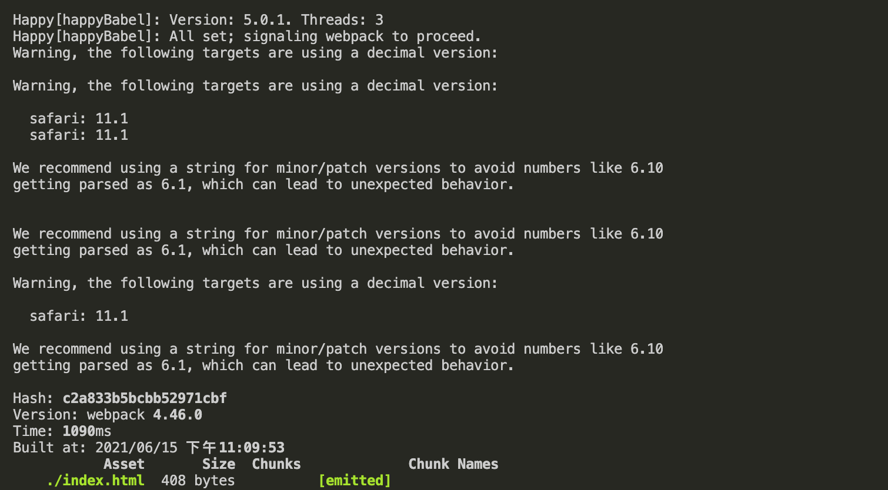
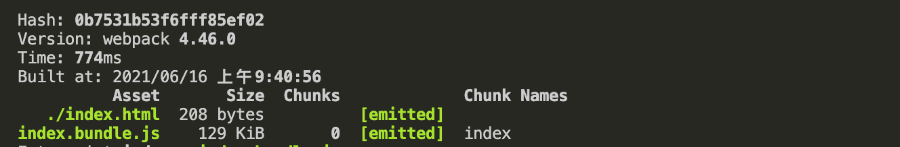

## 为什么要优化？

如果你的项目很小，构建很快，其实不用特别在意性能方面的问题。但是随着项目涉及到的页面越来越多，功能和业务代码也会越来越复杂，相应的 `webpack` 的构建时间也会越来越久，打包后的体积也会越来越大，这个时候我们就不得不考虑性能优化的事情了。


## 分析工具

在动手优化之前，我们需要有一个量化的指标，得知影响构建时间的问题究竟出在哪里，是某个 `chunk` 的体积太大，还是某个`loader`或者 `plugin`的耗时太久了等等。

我们可以通过一些工具对项目的 **体积** 和 **速度** 进行分析，让后对症下药。

### 体积分析

- 初级分析

可以通过官方提供的 `stat.json` 帮助我们分析打包结果， `stat.json` 可以通过下面的语句快速生成

```bash
npx webpack --profile --json > stats.json
```

接下来我们就可以通过官方提供的 [stat.json分析工具](https://github.com/webpack/analyse) 进行分析，目前已无法打开

- 使用第三方工具

[webpack-bundle-analyzer](https://github.com/webpack-contrib/webpack-bundle-analyzer) 是一个打包分析神器，它的界面也清晰，而且能很直观的给出每一个打包出来的文件的大小以及各自的依赖，能够更加方便的帮助我们对项目进行分析。

使用如下：

```js
// npm install --save-dev webpack-bundle-analyzer
const { BundleAnalyzerPlugin } = require('webpack-bundle-analyzer');

module.exports = {
  // ...
  plugins: [
    new BundleAnalyzerPlugin({
      analyzerPort: 8889, // 指定端口号
      openAnalyzer: false,
    })
  ],
  // ...
}
```


> `webpack-bundle-analyzer` 其底层也是依赖 `stat.json` 文件的，通过对 `stat.json` 的分析，得出最后的分析页面

通过分析工具的分析，我们可以知道哪些文件打包出来的体积比较大，从而对有问题的文件进行优化。

### 速度分析

我们可以通过 [speed-measure-webpack-plugin](https://github.com/stephencookdev/speed-measure-webpack-plugin) 这个插件帮助我们分析整个打包的总耗时，以及每一个`loader` 和每一个 `plugins` 构建所耗费的时间，从而帮助我们快速定位到可以优化 `Webpack` 的配置。

```js
// 安装 npm install --save-dev speed-measure-webpack-plugin

// 使用
const SpeedMeasurePlugin = require("speed-measure-webpack-plugin");
const smp = new SpeedMeasurePlugin();

const webpackConfig = smp.wrap({
  plugins: [
    new MyPlugin(),
    new MyOtherPlugin()
  ]
});
```


如上图所示，耗时比较长的都会以红色标出

> 注意：`speed-measure-webpack-plugin` 对于 `webpack` 的升级还不够完善，暂时还无法与你自己编写的挂载在 `html-webpack-plugin` 提供的 `hooks` 上的自定义 `Plugin` （`add-asset-html-webpack-plugin` 就是此类）共存，有人已经在 github 上提了 [issue](https://github.com/stephencookdev/speed-measure-webpack-plugin/issues/92) 了，但是貌似还是没有解决。

## 优化策略

经过相应的体积分析和速度分析之后，我们便可以着手进行优化了。

### 使用新版本

这个是 `webpack` 性能优化的万能膏药，升级版本必定能带来性能提升，而且提升很明显。


> 从上图中我们可以看到，`webpack4.0` 的构建速度远远快于 `webpack3.0`，官方也说升级版本之后，构建时间可以降低 `60% - 98%` 左右。

在每一个版本的更新，`webpack` 内部肯定会做很多优化，而 `webpack` 是依赖 `Node` 的 `js` 运行环境，升级他们对应的版本，`webpack` 的速度肯定也能够获得提升。

如果要迁移到 Webpack 4 也只需要检查一下 [checklist](https://dev.to/flexdinesh/upgrade-to-webpack-4---5bc5)，看看这些点是否都覆盖到了，就可以了。

#### webpack 4.0 带来的优化

- `v8` 引擎带来的优化（`for of` 替代 `forEach`、`Map` 和 `Set` 替代 `Object`、`includes` 替代 `indexOf`）
- 默认使用更快的 `md4 hash` 算法
- `webpack AST` 可以直接从 `loader` 传递给 `AST`，减少解析时间
- 使用字符串方法替代正则表达式

我们可以在 `github` 上的 `webpack` 库的 [releases 版本迭代](https://github.com/webpack/webpack/releases?after=v4.4.0) 页面中查看其带来的性能优化：


#### 一个V8性能的例子

我们可以来看一个例子，比较使用 `includes` 替代 `indexOf` 之后带来的速度提升，创建 `compare-includes-indexof.js` 文件，在这个文件中建一个 `10000000` 长度的数组，记录两个函数分别消耗的时间：

```js
const ARR_SIZE = 10000000;
const hugeArr = new Array(ARR_SIZE).fill(1);

// includes
const includesTest = () => {
  const arrCopy = [];
  console.time('includes')
  let i = 0;
  while (i < hugeArr.length) {
    arrCopy.includes(i++);
  }
  console.timeEnd('includes');
}

// indexOf
const indexOfTest = () => {
  const arrCopy = [];
  console.time('indexOf');
  for (let item of hugeArr) {
    arrCopy.indexOf(item);
  }
  console.timeEnd('indexOf');
}

includesTest();
indexOfTest();
```


所以在项目上尽可能使用比较新的 `webpack`、`Node`、`Npm`、`Yarn` 版本，是我们提升打包速度的第一步。

### 体积优化

`webpack` 是个项目打包工具，一般项目打完包以后，需要发布到服务器上供用户使用，为了用户体验，我们的项目体积需要越小越好，所以 `webpack` 中打包的体积是 `webpack` 中重要的一环。

#### js压缩

`webpack4.0` 默认在生产环境的时候是支持代码压缩的，即 `mode=production` 模式下

实际上 `webpack4.0` 默认是使用 [terser-webpack-plugin](https://github.com/webpack-contrib/terser-webpack-plugin) 这个压缩插件，在此之前是使用 [uglifyjs-webpack-plugin](https://github.com/webpack-contrib/uglifyjs-webpack-plugin)，两者的区别是后者对 ES6 的压缩不是很好，同时我们可以开启 `parallel` 参数，使用多进程压缩，加快压缩。

```js
// webpack.config.js
const TerserPlugin = require('terser-webpack-plugin');

module.exports = {
  // ...
  optimization: {
    minimize: true,
    minimizer: [
      new TerserPlugin({
        parallel: 4, // 开启几个进程来处理压缩，默认是 os.cpus().length - 1
      }),
    ],
  },
  // ...
}
```

#### css压缩

我们可以借助 [optimize-css-assets-webpack-plugin](https://github.com/NMFR/optimize-css-assets-webpack-plugin) 插件来压缩 `css`，其默认使用的压缩引擎是 `cssnano`。 具体使用如下：

```js
// npm install --save-dev optimize-css-assets-webpack-plugin
const OptimizeCSSAssetsPlugin = require("optimize-css-assets-webpack-plugin");
// ...
const prodConfig = {
  // ...
  optimization: {
    minimizer: [
      new OptimizeCSSAssetsPlugin({
        assetNameRegExp: /\.optimize\.css$/g, // 一个正则表达式，指示应优化\最小化的资产的名称。提供的正则表达式针对配置中
        cssProcessor: require('cssnano'), // 用于优化/最小化CSS的CSS处理器，默认为cssnano。
        cssProcessorPluginOptions: { // 传递给cssProcessor的插件选项，默认为 {}
          preset: ['default', { discardComments: { removeAll: true } }],
        },
        canPrint: true, // 一个布尔值，指示插件是否可以将消息打印到控制台，默认为 true
      })
    ]
  },
}
```

#### 擦除无用的css

使用 `PurgeCSS` 来完成对无用 `css` 的擦除，它需要和 `mini-css-extract-plugin` 配合使用。

```js
// npm install --save-dev mini-css-extract-plugin purgecss-webpack-plugin

const path = require('path');
const glob = require('glob');
const MiniCssExtractPlugin = require('mini-css-extract-plugin');
const PurgecssPlugin = require('purgecss-webpack-plugin');
// ...
const PATHS = {
  src: path.join(__dirname, 'src')
}

const commonConfig = {
  // ...
  plugins: [
    new MiniCssExtractPlugin({
      filename: "[name].css",
    }),
    new PurgecssPlugin({
      paths: glob.sync(`${PATHS.src}/**/*`,  { nodir: true }),
    }),
  ]
  // ...
}
```

在未使用此插件之前，比如我只用到了`bootsrap` 里面的 `btn btn-primary` 这个类，其他的都没用到，但是在打包之后发现未用到的css也会被打包进去


引入插件后，重新打包，发现没有用到的css都被擦除了


更多的使用方法可以参考： [PurgeCSS 文档](https://purgecss.com/plugins/webpack.html#usage)

#### 图片压缩

一般来说在打包之后，一些图片文件的大小是远远要比 `js` 或者 `css` 文件大很多，所以我们首先要做的就是对于图片的优化，我们可以手动的去通过线上的图片压缩工具，如 [tiny png](https://tinypng.com/) 帮我们来压缩图片。

但是这个比较繁琐，在项目中我们希望能够更加自动化一点，自动帮我们做好图片压缩，这个时候我们就可以借助 [image-webpack-loader](https://github.com/tcoopman/image-webpack-loader) 帮助我们来实现。它是基于 [imagemin](https://github.com/imagemin/imagemin) 这个 Node 库来实现图片压缩的。

使用很简单，我们只要在 `file-loader` 之后加入 `image-webpack-loader` 即可：

```js
// npm install --save-dev file-loader image-webpack-loader

// ...
module: {
  rules: [
    {
      test: /\.(png|jpeg|jpg|gif)$/,
      use: [
        {
          loader: 'file-loader',
          options: {
            name: '[name]_[hash].[ext]',
            outputPath: 'images/',
          }
        },
        {
          loader: 'image-webpack-loader',
          options: {
            // 压缩 jpeg 的配置
            mozjpeg: {
              progressive: true,
              quality: 65
            },
            // 使用 imagemin**-optipng 压缩 png，enable: false 为关闭
            optipng: {
              enabled: false,
            },
            // 使用 imagemin-pngquant 压缩 png
            pngquant: {
              quality: '65-90',
              speed: 4
            },
            // 压缩 gif 的配置
            gifsicle: {
              interlaced: false,
            },
            // 开启 webp，会把 jpg 和 png 图片压缩为 webp 格式
            webp: {
              quality: 75
            }
          }
        }
      ]
    },
  ]
}         
// ...
```

我们先不用这个loader打包，图片大小是100K


使用 `image-webpack-loader` 之后，图片大小是 `55KB`


#### Tree-shaking

有时候我们写的某些模块根本没有使用，但是还是被打包了，这样实际上会拖累 `webpack` 的打包速度，而且也会增加打包文件的体积，所以我们可以使用 `tree-shaking` 将这些代码剔除掉。这个是webpack自带的功能，默认支持，注意必须是 ES6 的语法，CJS 的方式不支持。

#### 代码拆分

从 webpack v4 开始，移除了 `CommonsChunkPlugin`，取而代之的是 `optimization.splitChunks`。它可以把一个大的文件分割成几个小的文件，这样也可以有效的提升 `webpack` 的打包速度。

webpack 将根据以下条件自动拆分 chunks：

- 新的 chunk 可以被共享，或者模块来自于 `node_modules` 文件夹
- 新的 chunk 体积大于 20kb（在进行 min+gz 之前的体积）
- 当按需加载 chunks 时，并行请求的最大数量小于或等于 30
- 当加载初始化页面时，并发请求的最大数量小于或等于 30

`optimization.splitChunks` 官方给了默认配置：

```js
splitChunks: {
  chunks: "async", // "initial" | "all"(推荐) | "async" (默认就是async) | 函数
  minSize: 20000, // 生成 chunk 的最小体积（以 bytes 为单位）
  minChunks: 1, // 最小 chunk ，默认1
  maxAsyncRequests: 30, // 最大异步请求数， 默认30
  maxInitialRequests: 30, // 最大初始化请求书，默认30
  automaticNameDelimiter: '~', // 打包分隔符, 例如 vendors~main.js
  name: true, // 打包后的名称，此选项可接收 function
  cacheGroups: { // 这里开始设置缓存的 chunks ，缓存组
    vendors: {
      test: /[\\/]node_modules[\\/]/,
      priority: -10,
    },
    default: {
      minChunks: 2,
      priority: -20,
      reuseExistingChunk: true, // 可设置是否重用该chunk
    }
  }
}
```

可以先通过 `webpack-bundle-analyzer` 分析出哪些文件占用比较大，再使用`splitChunks`进行合理的拆分。

下面看是一个之前老项目的例子，在没有使用此插件拆分之前：


我们对项目进行一些配置，拆分占用较大的文件

```js
optimization: {
          splitChunks: {
            maxInitialRequests: 4,
            automaticNameDelimiter: '_',
            cacheGroups: {
              swiper: {
                name: 'chunk-swiper',
                test: /[\\/]node_modules[\\/]swiper[\\/]/,
                chunks: 'all',
                priority: 5,
                reuseExistingChunk: true,
                enforce: true
              },
              vant: {
                name: 'chunk-vant',
                test: /[\\/]node_modules[\\/]vant[\\/]/,
                chunks: 'all',
                priority: 5,
                reuseExistingChunk: true,
                enforce: true
              },
              videojs: {
                name: 'chunk-videojs',
                test: /[\\/]node_modules[\\/](video\.js)|(videojs-contrib-hls)[\\/]/,
                chunks: 'all',
                priority: 5,
                reuseExistingChunk: true,
                enforce: true
              },
              utils: {
                name: 'chunk-utils',
                test: /[\\/]node_modules[\\/](crypto-js)|(md5\.js)|(core-js)|(axios)[\\/]/,
                chunks: 'all',
                priority: 5,
                reuseExistingChunk: true,
                enforce: true
              }
            }
          }
        }
```

再次打包之后：


更多的配置项，可以参考 [split-chunks-plugin](https://webpack.docschina.org/plugins/split-chunks-plugin/)

#### html-webpack-externals-plugin

[`html-webpack-externals-plugin`](https://github.com/mmiller42/html-webpack-externals-plugin)插件可以将一些公用包提取出来使用 `cdn` 引入，不打入 `bundle` 中

下面我们先来写一个vue的例子：

```js
import Vue from 'vue';
import VueRouter from 'vue-router';

Vue.use(VueRouter);

const Foo = { template: '<div>foo</div>' };
const Bar = { template: '<div>bar</div>' };

const routes = [
  { path: '/foo', component: Foo },
  { path: '/bar', component: Bar }
];

const router = new VueRouter({
  routes
});

const app = new Vue({
  router
}).$mount('#app');

```

我们打包看到`main.bundle.js`大小是 `97.7K`


接下来我们配置一下 `html-webpack-externals-plugin`

```js
// npm i --save-dev html-webpack-externals-plugin html-webpack-plugin@4.x
// 此插件需要依赖html-webpack-plugin，注意webpack4安装4.x版本

const htmlWebpackPlugin = require('html-webpack-plugin');
const HtmlWebpackExternalsPlugin = require('html-webpack-externals-plugin');

module.exports = {
  //...
  plugins: [
    new htmlWebpackPlugin({
      filename: './index.html',
    }),
    new HtmlWebpackExternalsPlugin({
      externals: [
        {
          module: 'vue',
          entry: 'https://unpkg.com/vue/dist/vue.js',
          global: 'Vue',
        }, {
          module: 'vue-router',
          entry: 'https://unpkg.com/vue-router/dist/vue-router.js',
          global: 'VueRouter'
        }
      ]
    })
  ]
}
```

再重新打包，可以看到 `main.bundle.js` 大小已经变成了`1.21K` ，同时在html中也自动帮我们引入了cdn脚本


### 速度优化

上面列举了一些常用的体积优化方案，接下来我们介绍一些速度优化方案

#### 分离配置文件

一般情况下，我们需要区分开发和生产两套环境，各司其职。

在开发阶段：我们需要 `webpack-dev-server` 来帮我们进行快速的开发，同时需要 **HMR 热更新** 帮我们进行页面的无刷新改动，而这些在 **生产环境** 中都是不需要的。

在生产阶段：我们需要进行 **代码压缩**、**目录清理**、**计算 hash**、**提取 CSS** 等等；

在实现起来也非常简单，可以参考vue-cli2.9的配置，将文件拆分为三个：

- webpack.dev.js 开发环境的配置文件
- webpack.prod.js 生产环境的配置文件
- webpack.common.js 公共配置文件

通过 `webpack-merge` 来整合两个配置文件共同的配置 `webpack.common.js`

#### 减少查找过程

对 `webpack` 的 `resolve` 参数进行合理配置，使用 `resolve` 字段告诉 `webpack` 怎么去搜索文件

- 合理使用 `resolve.extensions`

很多时候我们在引入模块的时候，都是不带后缀的，`webpack` 会自动带上后缀后去尝试询问文件是否存在，查询的顺序是按照我们配置 的 `resolve.extensions` 顺序从前到后查找，`webpack` 默认支持的后缀是 `js` 与 `json`。所以我们应该把常用到的文件后缀写在前面，或者 **我们导入模块时，尽量带上文件后缀名。**

> 虽然 `extensions` 会优先查找数组内的值，但是我们不要一股脑儿的把所有后缀都往里面塞，这会调用多次文件的查找，这样就会减慢打包速度。

- 优化 `resolve.modules`

这个属性告诉 `webpack` 解析模块时应该搜索的目录，绝对路径和相对路径都能使用。使用绝对路径之后，将只在给定目录中搜索，从而减少模块的搜索层级:

- 使用 `resolve.alias` 减少查找过程

`alias` 的意思为 **别名**，能把原导入路径映射成一个新的导入路径。这种写法不仅在编写时更方便，也能让 `webpack` 减少查找过程，比如以下配置：

```js
module.exports = {
  // ...
  resolve: {
    extensions: ['.vue', '.js'],
    mainFiles: ['index', 'list'],
    alias: {
      alias: path.resolve(__dirname, '../src/alias'),
    },
    modules: [
      path.resolve(__dirname, 'node_modules'), // 指定当前目录下的 node_modules 优先查找
      'node_modules', // 将默认写法放在后面
    ]
  },
  //...
}
```

#### 缩小构建目标

排除 `Webpack` 不需要解析的模块，即使用 `loader` 的时候，在尽量少的模块中去使用。

我们可以借助 `include` 和 `exclude` 这两个参数，规定 `loader` 只在那些模块应用和在哪些模块不应用。

```js
module.exports = {
  // ...
  module: {
    rules: [
      { 
        test: /\.js|jsx$/, 
        exclude: /node_modules/,
        include: path.resolve(__dirname, '../src'),
        use: ['babel-loader']
      },
      // ...
    ]
  },
  // ...
}
```

首先我们不加 `exclude` 和 `include` 两个参数，打包一下 `npm run build`，打包时间 `3280ms` 左右：


接着我们加上这两个参数，意思分别是：

- `exclude: /node_modules/`：排除 `node_modules` 下面的文件
- `include: path.resolve(__dirname, '../src')`：只对 `src` 下面的文件使用

重新打包，结果变成了`1021ms`


#### 利用多线程提升构建速度

由于运行在 `Node.js` 之上的 `webpack` 是单线程模型的，所以 `webpack` 需要处理的事情需要一件一件的做，不能多件事一起做

##### HappyPack

原理：每次 `webapck` 解析一个模块，`HappyPack` 会将它及它的依赖分配给 `worker` 线程中。处理完成之后，再将处理好的资源返回给 `HappyPack` 的主进程，从而加快打包速度。


> 在 `webpack4.0` 中使用 `happypack` 需要使用其 `5.0` 版本

我们将 `HappyPack` 引入公共配置文件，他的用法就是将相应的 `loader` 替换成 `happypack/loader`，同时将替换的 `loader` 放入其插件的 `loaders` 选项，我们暂且替换一下 `babel-loader`：

```js
const path = require('path');
const htmlWebpackPlugin = require('html-webpack-plugin');
const HappyPack = require('happypack');

module.exports = {
  mode: 'production',
  entry: {
    index: './src/index.js',
    entry1: './src/entry1.js',
    entry2: './src/entry2.js',
    entry3: './src/entry3.js',
    entry4: './src/entry4.js',
    entry5: './src/entry5.js',
  },
  output: {
    filename: '[name].bundle.js',
    path: path.join(__dirname, 'dist')
  },
  module: {
    rules: [
      {
        test: /\.(js|jsx)$/,
        use: [
          // 'babel-loader'
          'happypack/loader?id=happyBabel'
        ],
        exclude: /node_modules/,
        include: path.resolve(__dirname, 'src'),
      }
    ]
  },
  plugins: [
    new htmlWebpackPlugin({
      filename: './index.html',
    }),
    new HappyPack({
        id: 'happyBabel',
        loaders: ['babel-loader'],
        verbose: true,
    })
  ]
}
```

为了让打包更明显，在入口多增加了几个页面，首先是在使用 `happypack` 的情况下打包，耗时是5.7s左右


开启 `happypack` 之后，我们可以从控制台中看到，`happypack` 默认帮我们开启了 `3` 个进程，打包时间变成了1.1 左右：



> 注意：`HappyPack` 的作者现在基本上也不维护这个插件了，因为作者对此项目的兴趣正在减弱。他也推荐我们使用 `webpack` 官方 [thread-loader](https://github.com/webpack-contrib/thread-loader)。

更多参数大家可以参考 [HappyPack 官网](https://github.com/amireh/happypack)

##### thread-loader

`webpack` 官方推出的一个多进程方案，用来替代 `HappyPack`。

原理和 `HappyPack` 类似，`webpack` 每次解析一个模块，`thread-loader` 会将它及它的依赖分配给 `worker` 线程中，从而达到多进程打包的目的。

使用很简单，直接在我们使用的 `loader` 之前加上 `thread-loader` 就行，我们需要先注释掉 `HappyPack` 代码：

```js
// npm install --save-dev thread-loader
module.exports = {
  // ...
  module: {
    rules: [
      {
        test: /\.(js|jsx)$/,
        use: [
          {
            loader: 'thread-loader',
            options: {
              workers: 3, // 开启几个 worker 进程来处理打包，默认是 os.cpus().length - 1
            }
          },
          'babel-loader'
          // 'happypack/loader?id=happyBabel'
        ],
        exclude: /node_modules/,
        include: path.resolve(__dirname, 'src'),
      }
    ]
  },
  // ...
}
```

重新打包之后和 `happypack` 打包的结果差不多


#### 预先编译资源模块（DllPlugin）

我们在打包的时候，一般来说第三方模块是不会变化的，所以我们想只要在第一次打包的时候去打包一下第三方模块，并将第三方模块打包到一个特定的文件中，当第二次 `webpack` 进行打包的时候，就不需要去 `node_modules` 中去引入第三方模块，而是直接使用我们第一次打包的第三方模块的文件就行。

`webpack.DllPlugin` 就是来解决这个问题的插件，使用它可以在第一次编译打包后就生成一份不变的代码供其他模块引用，这样下一次构建的时候就可以节省开发时编译打包的时间。

`DllPlugin`是`webpack`内置的插件，不需要额外安装，直接配置`webpack.dll.config.js`文件：

```js
const path = require('path');
const webpack = require('webpack');

module.exports = {
  entry: {
    // 需要打包的第三方库
    react: ['react', 'react-dom']
  },
  output: {
    // 输出的动态链接库的文件名称，[name] 代表当前动态链接库的名称，
    filename: '[name].dll.js',
    path: path.resolve(__dirname, 'dist/dll'),
    // library必须和后面dllplugin中的name一致 后面会说明
    library: '[name]_dll_[hash]'
  },
  plugins: [
    // 接入 DllPlugin
    new webpack.DllPlugin({
      // 动态链接库的全局变量名称，需要和 output.library 中保持一致
      // 该字段的值也就是输出的 manifest.json 文件 中 name 字段的值
      name: '[name]_dll_[hash]',
      // 描述动态链接库的 manifest.json 文件输出时的文件名称
      path: path.join(__dirname, 'dist/dll', '[name].manifest.json')
    }),
  ]
}
```

- 上面的 `library` 的意思其实就是将 `dll` 文件以一个全局变量的形式导出出去，便于接下来引用，如下图：
- `mainfest.json` 文件是一个映射关系，它的作用就是帮助 `webpack` 使用我们之前打包好的 `***.dll.js` 文件，而不是重新再去 `node_modules` 中去寻找。

我们在 `package.json` 中配置打包的命令，进行dll打包，可以看到根目录生成了一个 `dll` 文件夹，并且在下面生成了相应的文件

```json
{
	"scripts": {
    "build": "webpack",
    "dll": "webpack --config webpack.dll.config"
  },
}
```


接着我们需要去修改公共配置文件 `webpack.config.js`，将我们之前生成的 `dll` 文件导入到 `html` 中去，如果我们不想自己手动向 `html` 文件去添加 `dll` 文件的时候，我们可以借助一个插件 `add-asset-html-webpack-plugin`，此插件顾名思义，就是将一些文件加到 `html` 中去。

```js
// npm install --save-dev add-asset-html-webpack-plugin

const path = require('path');
const webpack = require('webpack');
const htmlWebpackPlugin = require('html-webpack-plugin');
const AddAssetHtmlWebpackPlugin = require('add-asset-html-webpack-plugin');

module.exports = {
  // ...
  plugins: [
    new htmlWebpackPlugin({
      filename: './index.html'
    }),
    new AddAssetHtmlWebpackPlugin({
      filepath: path.resolve(__dirname, 'dist/dll/react.dll.js')
    }),
    new webpack.DllReferencePlugin({
      manifest: path.resolve(__dirname, 'dist/dll/react.manifest.json')
    })
  ]
}
```

我们再进行一次打包，可以看到打包耗时为 `697ms`，缩短了打包时间


#### 缓存 Cache 相关

我们可以开启相应 `loader` 或者 `plugin` 的缓存，来提升二次构建的速度。一般我们可以通过下面几项来完成：

- `babel-loader` 开启缓存
- `terser-webpack-plugin` 开启缓存
- 使用 `cache-loader` 或者 [hard-source-webpack-plugin](https://github.com/mzgoddard/hard-source-webpack-plugin)

如果项目中有缓存的话，在 `node_modules` 下会有相应的 `.cache` 目录来存放相应的缓存。

##### babel-loader

首先我们开启 `babel-loader` 的缓存，我们修改 `babel-loader` 的参数，将参数 `cacheDirectory` 设置为 `true`即可

```js
module.exports = {
  // ...
  module: {
    rules: [
      {
        test: /\.(js|jsx)$/,
        use: [
          {
            loader: 'babel-loader',
            options: {
              cacheDirectory: true,
            }
          },
        ],
        // exclude: /node_modules/,
        // include: path.resolve(__dirname, 'src'),
      }
    ]
  }
}
```

首次打包时间为 `3.3s` 左右，打包完成之后，我们可以发现在 `node_modules` 下生成了一个 `.cache` 目录，里面存放了 `babel` 的缓存文件:


再重新打包一次，时间变成了 `774ms`：



##### TerserPlugin

我们通过将 `TerserPlugin` 中的 `cache` 设为 `true`，就可以开启缓存：

```js
// npm install --save-dev terser-webpack-plugin@4.x  注意webpack4 要使用4.x版本
const TerserPlugin = require('terser-webpack-plugin');
module.exports = {
  // ...
  optimization: {
    minimize: true,
    minimizer: [
      new TerserPlugin({
        parallel: 4, // 开启几个进程来处理压缩，默认是 os.cpus().length - 1
        cache: true,
      }),
    ],
  },
  // ...
}
```

和上面一样，也会在 `node_modules` 目录下生成 `.cache` 文件，下面包含 `terser-webpack-plugin` 目录

##### HardSourceWebpackPlugin

这个插件其实就是用于给模块提供一个中间的缓存。

使用如下，我们直接在插件中引入就 ok 了：

```js
// npm install --save-dev hard-source-webpack-plugin
const HardSourceWebpackPlugin = require('hard-source-webpack-plugin');

module.exports = {
  // ...
  plugins: [
    new HardSourceWebpackPlugin()
  ],
  // ...
}
```

具体的一些其他配置，参考 [hard-source-webpack-plugin](https://github.com/mzgoddard/hard-source-webpack-plugin)

#### 合理使用 sourceMap

打包生成 `sourceMap` 的时候，如果信息越详细，打包速度就会越慢

> eval： 生成代码 每个模块都被eval执行，并且存在@sourceURL
>
> cheap-eval-source-map： 转换代码（行内） 每个模块被eval执行，并且sourcemap作为eval的一个dataurl
>
> cheap-module-eval-source-map： 原始代码（只有行内） 同样道理，但是更高的质量和更低的性能
>
> eval-source-map： 原始代码 同样道理，但是最高的质量和最低的性能
>
> cheap-source-map： 转换代码（**行内**） 生成的sourcemap没有列映射，从loaders生成的sourcemap没有被使用
>
> cheap-module-source-map： 原始代码（**只有行内**） 与上面一样除了每行特点的从loader中进行映射
>
> source-map： 原始代码 最好的sourcemap质量有完整的结果，但是会很慢

对于打包后的`sourceMap`，[webpack提供多种类型的配置](https://webpack.docschina.org/configuration/devtool/#devtool)。


### 其他优化

- 尽量都使用`ES6 Modules` 语法，以保证 `Tree-Shaking` 起作用

因为 `tree-shaking` 只对 `ES6 Modules` 静态引入生效，对于类似于 `CommonJs` 的动态引入方式是无效的

- 合理使用 `Ployfill`

如果我们对于引入的 `polyfill` 不做处理的话，`Webpack` 会把所有的 `Polyfill` 都加载进来，导致产出文件过大。推荐使用 `@babel/preset-env` 的 `useBuiltIns='usage'` 方案，此配置项会根据浏览器的兼容性帮助我们按需引入所需的垫片；此外我们也可以使用动态 `polyfill` 服务，每次根据浏览器的 `User Agent`，下发不同的 `Polyfill`，具体可以参考 [`polyfill.io`](https://polyfill.io/v3/)。

- 预加载资源 `webpackPrefetch`

使用 `webpackPrefetch` 来提前预加载一些资源，意思就是 **将来可能需要一些模块资源，在核心代码加载完成之后带宽空闲的时候再去加载需要用到的模块代码。**

- `icon` 类图片使用 `css Sprite` 来合并图片

如果 `icon` 类图片太多的话，就使用雪碧图合成一张图片，减少网络请求，或者使用字体文件 `iconfont`

- 合理配置 `chunk` 的哈希值

在生产环境打包，一定要配置文件的 `hash`，这样有助于浏览器缓存我们的文件，当我们的代码文件没变化的时候，用户就只需要读取浏览器缓存的文件即可。**一般来说 `javascript` 文件使用 `[chunkhash]`、`css` 文件使用 `[contenthash]`、其他资源（例如图片、字体等）使用 `[hash]`。**


参考文章：

https://github.com/darrell0904/webpack-doc

https://webpack.docschina.org/

